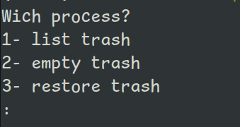
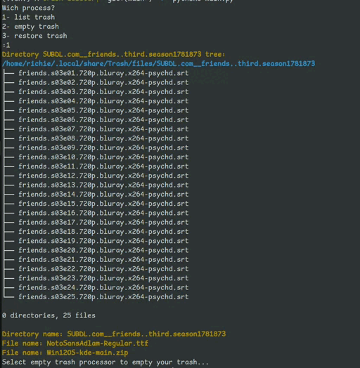
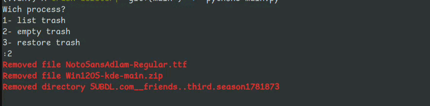

# Empry or manage the Linux trash

## Use:
- Run: `sudo apt install tree`
- Run: `pip install -r requirements.txt`
- Run: `python3 main.py`

## Now choose your process:
 
</img>
- 1 OR 'list trash' => List all files and directories in your trash.
- 2 OR 'empty trash' => Empty all files and directories in the trash.
- 3 OR 'restore trash' => Restore all files and directories in new address.

## List of all files and directories
</img>

## Removed all files and directories
</img>
